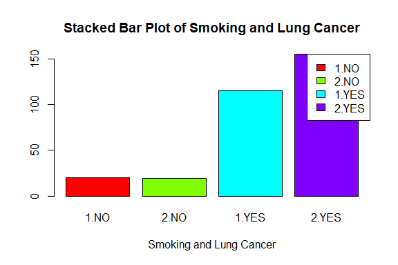

Lung Cancer Prediction
================
Trevor Okinda
2024

- [Student Details](#student-details)
- [Setup Chunk](#setup-chunk)
  - [Source:](#source)
  - [Reference:](#reference)
- [Exploratory Data Analysis](#exploratory-data-analysis)
  - [Measures of frequency](#measures-of-frequency)
  - [Measures of Central Tendency](#measures-of-central-tendency)
  - [Measures of Distribution](#measures-of-distribution)
  - [Measures of Relationship](#measures-of-relationship)
  - [Plots](#plots)
- [Preprocessing and Data
  Transformation](#preprocessing-and-data-transformation)
  - [Missing Values](#missing-values)
- [Training Model](#training-model)
  - [Data Splitting](#data-splitting)
  - [Bootstrapping](#bootstrapping)
  - [Cross-Validation](#cross-validation)
  - [Training Different Models](#training-different-models)
  - [Performance Comparison](#performance-comparison)
  - [Saving Model](#saving-model)

# Student Details

|                       |                        |
|-----------------------|------------------------|
| **Student ID Number** | 134780                 |
| **Student Name**      | Trevor Okinda          |
| **BBIT 4.2 Group**    | C                      |
| **Project Name**      | Lung Cancer Prediction |

# Setup Chunk

**Note:** the following KnitR options have been set as the global
defaults: <BR>
`knitr::opts_chunk$set(echo = TRUE, warning = FALSE, eval = TRUE, collapse = FALSE, tidy = TRUE)`.

More KnitR options are documented here
<https://bookdown.org/yihui/rmarkdown-cookbook/chunk-options.html> and
here <https://yihui.org/knitr/options/>.

### Source:

The dataset that was used can be downloaded here:
*\<<a href="https://www.kaggle.com/datasets/nancyalaswad90/lung-cancer\"
class="uri">https://www.kaggle.com/datasets/nancyalaswad90/lung-cancer\</a>\>*

### Reference:

*\<Hong, Z. Q., & Yang, J. Y. (1991). Lung Cancer Dataset \[Dataset\].
Kaggle. Retrieved from
<a href="https://www.kaggle.com/datasets/nancyalaswad90/lung-cancer/\"
class="uri">https://www.kaggle.com/datasets/nancyalaswad90/lung-cancer/\</a>\>  
Refer to the APA 7th edition manual for rules on how to cite datasets:
<https://apastyle.apa.org/style-grammar-guidelines/references/examples/data-set-references>*

# Exploratory Data Analysis

\##Load dataset

``` r
# Load dataset
lung_cancer_data <- read.csv("lung_cancer.csv", colClasses = c(
  GENDER = "factor",
  AGE = "numeric",
  SMOKING = "factor",
  YELLOW_FINGERS = "factor",
  ANXIETY = "factor",
  PEER_PRESSURE = "factor",
  CHRONIC_DISEASE = "factor",
  FATIGUE = "factor",
  ALLERGY = "factor",
  WHEEZING = "factor",
  ALCOHOL_CONSUMING = "factor",
  COUGHING = "factor",
  SHORTNESS_OF_BREATH = "factor",
  SWALLOWING_DIFFICULTY = "factor",
  CHEST_PAIN = "factor",
  LUNG_CANCER = "factor"
))

# Display the structure of the dataset
str(lung_cancer_data)
```

    ## 'data.frame':    309 obs. of  16 variables:
    ##  $ GENDER               : Factor w/ 2 levels "F","M": 2 2 1 2 1 1 2 1 1 2 ...
    ##  $ AGE                  : num  69 74 59 63 63 75 52 51 68 53 ...
    ##  $ SMOKING              : Factor w/ 2 levels "1","2": 1 2 1 2 1 1 2 2 2 2 ...
    ##  $ YELLOW_FINGERS       : Factor w/ 2 levels "1","2": 2 1 1 2 2 2 1 2 1 2 ...
    ##  $ ANXIETY              : Factor w/ 2 levels "1","2": 2 1 1 2 1 1 1 2 2 2 ...
    ##  $ PEER_PRESSURE        : Factor w/ 2 levels "1","2": 1 1 2 1 1 1 1 2 1 2 ...
    ##  $ CHRONIC_DISEASE      : Factor w/ 2 levels "1","2": 1 2 1 1 1 2 1 1 1 2 ...
    ##  $ FATIGUE              : Factor w/ 2 levels "1","2": 2 2 2 1 1 2 2 2 2 1 ...
    ##  $ ALLERGY              : Factor w/ 2 levels "1","2": 1 2 1 1 1 2 1 2 1 2 ...
    ##  $ WHEEZING             : Factor w/ 2 levels "1","2": 2 1 2 1 2 2 2 1 1 1 ...
    ##  $ ALCOHOL_CONSUMING    : Factor w/ 2 levels "1","2": 2 1 1 2 1 1 2 1 1 2 ...
    ##  $ COUGHING             : Factor w/ 2 levels "1","2": 2 1 2 1 2 2 2 1 1 1 ...
    ##  $ SHORTNESS_OF_BREATH  : Factor w/ 2 levels "1","2": 2 2 2 1 2 2 2 2 1 1 ...
    ##  $ SWALLOWING_DIFFICULTY: Factor w/ 2 levels "1","2": 2 2 1 2 1 1 1 2 1 2 ...
    ##  $ CHEST_PAIN           : Factor w/ 2 levels "1","2": 2 2 2 2 1 1 2 1 1 2 ...
    ##  $ LUNG_CANCER          : Factor w/ 2 levels "NO","YES": 2 2 1 1 1 2 2 2 1 2 ...

``` r
# View the first few rows of the dataset
head(lung_cancer_data)
```

    ##   GENDER AGE SMOKING YELLOW_FINGERS ANXIETY PEER_PRESSURE CHRONIC_DISEASE
    ## 1      M  69       1              2       2             1               1
    ## 2      M  74       2              1       1             1               2
    ## 3      F  59       1              1       1             2               1
    ## 4      M  63       2              2       2             1               1
    ## 5      F  63       1              2       1             1               1
    ## 6      F  75       1              2       1             1               2
    ##   FATIGUE ALLERGY WHEEZING ALCOHOL_CONSUMING COUGHING SHORTNESS_OF_BREATH
    ## 1       2       1        2                 2        2                   2
    ## 2       2       2        1                 1        1                   2
    ## 3       2       1        2                 1        2                   2
    ## 4       1       1        1                 2        1                   1
    ## 5       1       1        2                 1        2                   2
    ## 6       2       2        2                 1        2                   2
    ##   SWALLOWING_DIFFICULTY CHEST_PAIN LUNG_CANCER
    ## 1                     2          2         YES
    ## 2                     2          2         YES
    ## 3                     1          2          NO
    ## 4                     2          2          NO
    ## 5                     1          1          NO
    ## 6                     1          1         YES

``` r
# View the dataset in a separate viewer window
View(lung_cancer_data)
```

## Measures of frequency

``` r
# Measures of Frequency

# Count of observations for each level of GENDER
gender_freq <- table(lung_cancer_data$GENDER)
print("Frequency of Gender:")
```

    ## [1] "Frequency of Gender:"

``` r
print(gender_freq)
```

    ## 
    ##   F   M 
    ## 147 162

``` r
# Count of observations for each level of SMOKING
smoking_freq <- table(lung_cancer_data$SMOKING)
print("Frequency of Smoking:")
```

    ## [1] "Frequency of Smoking:"

``` r
print(smoking_freq)
```

    ## 
    ##   1   2 
    ## 135 174

``` r
# Count of observations for each level of YELLOW_FINGERS
yellow_fingers_freq <- table(lung_cancer_data$YELLOW_FINGERS)
print("Frequency of Yellow Fingers:")
```

    ## [1] "Frequency of Yellow Fingers:"

``` r
print(yellow_fingers_freq)
```

    ## 
    ##   1   2 
    ## 133 176

``` r
# Count of observations for each level of ANXIETY
anxiety_freq <- table(lung_cancer_data$ANXIETY)
print("Frequency of Anxiety:")
```

    ## [1] "Frequency of Anxiety:"

``` r
print(anxiety_freq)
```

    ## 
    ##   1   2 
    ## 155 154

``` r
# Count of observations for each level of PEER_PRESSURE
peer_pressure_freq <- table(lung_cancer_data$PEER_PRESSURE)
print("Frequency of Peer Pressure:")
```

    ## [1] "Frequency of Peer Pressure:"

``` r
print(peer_pressure_freq)
```

    ## 
    ##   1   2 
    ## 154 155

``` r
# Count of observations for each level of CHRONIC_DISEASE
chronic_disease_freq <- table(lung_cancer_data$CHRONIC_DISEASE)
print("Frequency of Chronic Disease:")
```

    ## [1] "Frequency of Chronic Disease:"

``` r
print(chronic_disease_freq)
```

    ## 
    ##   1   2 
    ## 153 156

``` r
# Count of observations for each level of FATIGUE
fatigue_freq <- table(lung_cancer_data$FATIGUE)
print("Frequency of Fatigue:")
```

    ## [1] "Frequency of Fatigue:"

``` r
print(fatigue_freq)
```

    ## 
    ##   1   2 
    ## 101 208

``` r
# Count of observations for each level of ALLERGY
allergy_freq <- table(lung_cancer_data$ALLERGY)
print("Frequency of Allergy:")
```

    ## [1] "Frequency of Allergy:"

``` r
print(allergy_freq)
```

    ## 
    ##   1   2 
    ## 137 172

``` r
# Count of observations for each level of WHEEZING
wheezing_freq <- table(lung_cancer_data$WHEEZING)
print("Frequency of Wheezing:")
```

    ## [1] "Frequency of Wheezing:"

``` r
print(wheezing_freq)
```

    ## 
    ##   1   2 
    ## 137 172

``` r
# Count of observations for each level of ALCOHOL_CONSUMING
alcohol_consuming_freq <- table(lung_cancer_data$ALCOHOL_CONSUMING)
print("Frequency of Alcohol Consuming:")
```

    ## [1] "Frequency of Alcohol Consuming:"

``` r
print(alcohol_consuming_freq)
```

    ## 
    ##   1   2 
    ## 137 172

``` r
# Count of observations for each level of COUGHING
coughing_freq <- table(lung_cancer_data$COUGHING)
print("Frequency of Coughing:")
```

    ## [1] "Frequency of Coughing:"

``` r
print(coughing_freq)
```

    ## 
    ##   1   2 
    ## 130 179

``` r
# Count of observations for each level of SHORTNESS_OF_BREATH
shortness_of_breath_freq <- table(lung_cancer_data$SHORTNESS_OF_BREATH)
print("Frequency of Shortness of Breath:")
```

    ## [1] "Frequency of Shortness of Breath:"

``` r
print(shortness_of_breath_freq)
```

    ## 
    ##   1   2 
    ## 111 198

``` r
# Count of observations for each level of SWALLOWING_DIFFICULTY
swallowing_difficulty_freq <- table(lung_cancer_data$SWALLOWING_DIFFICULTY)
print("Frequency of Swallowing Difficulty:")
```

    ## [1] "Frequency of Swallowing Difficulty:"

``` r
print(swallowing_difficulty_freq)
```

    ## 
    ##   1   2 
    ## 164 145

``` r
# Count of observations for each level of CHEST_PAIN
chest_pain_freq <- table(lung_cancer_data$CHEST_PAIN)
print("Frequency of Chest Pain:")
```

    ## [1] "Frequency of Chest Pain:"

``` r
print(chest_pain_freq)
```

    ## 
    ##   1   2 
    ## 137 172

``` r
# Count of observations for each level of LUNG_CANCER
lung_cancer_freq <- table(lung_cancer_data$LUNG_CANCER)
print("Frequency of Lung Cancer:")
```

    ## [1] "Frequency of Lung Cancer:"

``` r
print(lung_cancer_freq)
```

    ## 
    ##  NO YES 
    ##  39 270

## Measures of Central Tendency

``` r
# Measures of Central Tendency

# Calculate mean, median, and mode for AGE
age_mean <- mean(lung_cancer_data$AGE)
age_median <- median(lung_cancer_data$AGE)
age_mode <- as.numeric(names(sort(-table(lung_cancer_data$AGE))[1]))

print("Measures of Central Tendency for Age:")
```

    ## [1] "Measures of Central Tendency for Age:"

``` r
print(paste("Mean:", age_mean))
```

    ## [1] "Mean: 62.673139158576"

``` r
print(paste("Median:", age_median))
```

    ## [1] "Median: 62"

``` r
print(paste("Mode:", age_mode))
```

    ## [1] "Mode: 64"

``` r
# For categorical variables, we can only calculate mode
# Calculate mode for other variables

# Function to calculate mode
calculate_mode <- function(x) {
  tbl <- table(x)
  mode_value <- as.numeric(names(tbl)[which.max(tbl)])
  return(mode_value)
}

# Calculate mode for other variables
mode_smoking <- calculate_mode(lung_cancer_data$SMOKING)
mode_yellow_fingers <- calculate_mode(lung_cancer_data$YELLOW_FINGERS)
mode_anxiety <- calculate_mode(lung_cancer_data$ANXIETY)
mode_peer_pressure <- calculate_mode(lung_cancer_data$PEER_PRESSURE)
mode_chronic_disease <- calculate_mode(lung_cancer_data$CHRONIC_DISEASE)
mode_fatigue <- calculate_mode(lung_cancer_data$FATIGUE)
mode_allergy <- calculate_mode(lung_cancer_data$ALLERGY)
mode_wheezing <- calculate_mode(lung_cancer_data$WHEEZING)
mode_alcohol_consuming <- calculate_mode(lung_cancer_data$ALCOHOL_CONSUMING)
mode_coughing <- calculate_mode(lung_cancer_data$COUGHING)
mode_shortness_of_breath <- calculate_mode(lung_cancer_data$SHORTNESS_OF_BREATH)
mode_swallowing_difficulty <- calculate_mode(lung_cancer_data$SWALLOWING_DIFFICULTY)
mode_chest_pain <- calculate_mode(lung_cancer_data$CHEST_PAIN)

# Print the calculated modes
print("Mode for Smoking:")
```

    ## [1] "Mode for Smoking:"

``` r
print(mode_smoking)
```

    ## [1] 2

``` r
print("Mode for Yellow Fingers:")
```

    ## [1] "Mode for Yellow Fingers:"

``` r
print(mode_yellow_fingers)
```

    ## [1] 2

``` r
print("Mode for Anxiety:")
```

    ## [1] "Mode for Anxiety:"

``` r
print(mode_anxiety)
```

    ## [1] 1

``` r
print("Mode for Peer Pressure:")
```

    ## [1] "Mode for Peer Pressure:"

``` r
print(mode_peer_pressure)
```

    ## [1] 2

``` r
print("Mode for Chronic Disease:")
```

    ## [1] "Mode for Chronic Disease:"

``` r
print(mode_chronic_disease)
```

    ## [1] 2

``` r
print("Mode for Fatigue:")
```

    ## [1] "Mode for Fatigue:"

``` r
print(mode_fatigue)
```

    ## [1] 2

``` r
print("Mode for Allergy:")
```

    ## [1] "Mode for Allergy:"

``` r
print(mode_allergy)
```

    ## [1] 2

``` r
print("Mode for Wheezing:")
```

    ## [1] "Mode for Wheezing:"

``` r
print(mode_wheezing)
```

    ## [1] 2

``` r
print("Mode for Alcohol Consuming:")
```

    ## [1] "Mode for Alcohol Consuming:"

``` r
print(mode_alcohol_consuming)
```

    ## [1] 2

``` r
print("Mode for Coughing:")
```

    ## [1] "Mode for Coughing:"

``` r
print(mode_coughing)
```

    ## [1] 2

``` r
print("Mode for Shortness of Breath:")
```

    ## [1] "Mode for Shortness of Breath:"

``` r
print(mode_shortness_of_breath)
```

    ## [1] 2

``` r
print("Mode for Swallowing Difficulty:")
```

    ## [1] "Mode for Swallowing Difficulty:"

``` r
print(mode_swallowing_difficulty)
```

    ## [1] 1

``` r
print("Mode for Chest Pain:")
```

    ## [1] "Mode for Chest Pain:"

``` r
print(mode_chest_pain)
```

    ## [1] 2

## Measures of Distribution

``` r
# Measures of Distribution

# Frequency distribution for categorical variables
# Function to calculate frequency distribution
calculate_frequency_distribution <- function(x) {
  tbl <- table(x)
  freq_dist <- data.frame(Level = as.numeric(names(tbl)), Frequency = as.numeric(tbl))
  return(freq_dist)
}

# Calculate frequency distribution for categorical variables
freq_dist_gender <- calculate_frequency_distribution(lung_cancer_data$GENDER)
freq_dist_smoking <- calculate_frequency_distribution(lung_cancer_data$SMOKING)
freq_dist_yellow_fingers <- calculate_frequency_distribution(lung_cancer_data$YELLOW_FINGERS)
freq_dist_anxiety <- calculate_frequency_distribution(lung_cancer_data$ANXIETY)
freq_dist_peer_pressure <- calculate_frequency_distribution(lung_cancer_data$PEER_PRESSURE)
freq_dist_chronic_disease <- calculate_frequency_distribution(lung_cancer_data$CHRONIC_DISEASE)
freq_dist_fatigue <- calculate_frequency_distribution(lung_cancer_data$FATIGUE)
freq_dist_allergy <- calculate_frequency_distribution(lung_cancer_data$ALLERGY)
freq_dist_wheezing <- calculate_frequency_distribution(lung_cancer_data$WHEEZING)
freq_dist_alcohol_consuming <- calculate_frequency_distribution(lung_cancer_data$ALCOHOL_CONSUMING)
freq_dist_coughing <- calculate_frequency_distribution(lung_cancer_data$COUGHING)
freq_dist_shortness_of_breath <- calculate_frequency_distribution(lung_cancer_data$SHORTNESS_OF_BREATH)
freq_dist_swallowing_difficulty <- calculate_frequency_distribution(lung_cancer_data$SWALLOWING_DIFFICULTY)
freq_dist_chest_pain <- calculate_frequency_distribution(lung_cancer_data$CHEST_PAIN)
freq_dist_lung_cancer <- calculate_frequency_distribution(lung_cancer_data$LUNG_CANCER)

# Print the frequency distribution for each categorical variable
print("Frequency Distribution for Gender:")
```

    ## [1] "Frequency Distribution for Gender:"

``` r
print(freq_dist_gender)
```

    ##   Level Frequency
    ## 1    NA       147
    ## 2    NA       162

``` r
print("Frequency Distribution for Smoking:")
```

    ## [1] "Frequency Distribution for Smoking:"

``` r
print(freq_dist_smoking)
```

    ##   Level Frequency
    ## 1     1       135
    ## 2     2       174

``` r
print("Frequency Distribution for Yellow Fingers:")
```

    ## [1] "Frequency Distribution for Yellow Fingers:"

``` r
print(freq_dist_yellow_fingers)
```

    ##   Level Frequency
    ## 1     1       133
    ## 2     2       176

``` r
print("Frequency Distribution for Anxiety:")
```

    ## [1] "Frequency Distribution for Anxiety:"

``` r
print(freq_dist_anxiety)
```

    ##   Level Frequency
    ## 1     1       155
    ## 2     2       154

``` r
print("Frequency Distribution for Peer Pressure:")
```

    ## [1] "Frequency Distribution for Peer Pressure:"

``` r
print(freq_dist_peer_pressure)
```

    ##   Level Frequency
    ## 1     1       154
    ## 2     2       155

``` r
print("Frequency Distribution for Chronic Disease:")
```

    ## [1] "Frequency Distribution for Chronic Disease:"

``` r
print(freq_dist_chronic_disease)
```

    ##   Level Frequency
    ## 1     1       153
    ## 2     2       156

``` r
print("Frequency Distribution for Fatigue:")
```

    ## [1] "Frequency Distribution for Fatigue:"

``` r
print(freq_dist_fatigue)
```

    ##   Level Frequency
    ## 1     1       101
    ## 2     2       208

``` r
print("Frequency Distribution for Allergy:")
```

    ## [1] "Frequency Distribution for Allergy:"

``` r
print(freq_dist_allergy)
```

    ##   Level Frequency
    ## 1     1       137
    ## 2     2       172

``` r
print("Frequency Distribution for Wheezing:")
```

    ## [1] "Frequency Distribution for Wheezing:"

``` r
print(freq_dist_wheezing)
```

    ##   Level Frequency
    ## 1     1       137
    ## 2     2       172

``` r
print("Frequency Distribution for Alcohol Consuming:")
```

    ## [1] "Frequency Distribution for Alcohol Consuming:"

``` r
print(freq_dist_alcohol_consuming)
```

    ##   Level Frequency
    ## 1     1       137
    ## 2     2       172

``` r
print("Frequency Distribution for Coughing:")
```

    ## [1] "Frequency Distribution for Coughing:"

``` r
print(freq_dist_coughing)
```

    ##   Level Frequency
    ## 1     1       130
    ## 2     2       179

``` r
print("Frequency Distribution for Shortness of Breath:")
```

    ## [1] "Frequency Distribution for Shortness of Breath:"

``` r
print(freq_dist_shortness_of_breath)
```

    ##   Level Frequency
    ## 1     1       111
    ## 2     2       198

``` r
print("Frequency Distribution for Swallowing Difficulty:")
```

    ## [1] "Frequency Distribution for Swallowing Difficulty:"

``` r
print(freq_dist_swallowing_difficulty)
```

    ##   Level Frequency
    ## 1     1       164
    ## 2     2       145

``` r
print("Frequency Distribution for Chest Pain:")
```

    ## [1] "Frequency Distribution for Chest Pain:"

``` r
print(freq_dist_chest_pain)
```

    ##   Level Frequency
    ## 1     1       137
    ## 2     2       172

``` r
print("Frequency Distribution for Lung Cancer:")
```

    ## [1] "Frequency Distribution for Lung Cancer:"

``` r
print(freq_dist_lung_cancer)
```

    ##   Level Frequency
    ## 1    NA        39
    ## 2    NA       270

## Measures of Relationship

``` r
# Contingency table and chi-square test for Gender and Lung Cancer
gender_lung_contingency <- table(lung_cancer_data$GENDER, lung_cancer_data$LUNG_CANCER)
print("Contingency Table for Gender and Lung Cancer:")
```

    ## [1] "Contingency Table for Gender and Lung Cancer:"

``` r
print(gender_lung_contingency)
```

    ##    
    ##      NO YES
    ##   F  22 125
    ##   M  17 145

``` r
chi_square_gender_lung <- chisq.test(gender_lung_contingency)
print("Chi-square Test for Gender and Lung Cancer:")
```

    ## [1] "Chi-square Test for Gender and Lung Cancer:"

``` r
print(chi_square_gender_lung)
```

    ## 
    ##  Pearson's Chi-squared test with Yates' continuity correction
    ## 
    ## data:  gender_lung_contingency
    ## X-squared = 1.0215, df = 1, p-value = 0.3122

``` r
# ANOVA for Gender and Age
anova_gender_age <- aov(AGE ~ GENDER, data = lung_cancer_data)
print("ANOVA for Gender and Age:")
```

    ## [1] "ANOVA for Gender and Age:"

``` r
print(summary(anova_gender_age))
```

    ##              Df Sum Sq Mean Sq F value Pr(>F)
    ## GENDER        1      9    9.43   0.139  0.709
    ## Residuals   307  20753   67.60

## Plots

``` r
# Histogram for Age
hist(lung_cancer_data$AGE, main = "Histogram of Age", xlab = "Age", col = "skyblue", border = "black")
```

<!-- -->

``` r
# Bar plot for Gender
barplot(table(lung_cancer_data$GENDER), main = "Bar Plot of Gender", xlab = "Gender", ylab = "Frequency", col = "skyblue")
```

<!-- -->

``` r
# Pie chart for Smoking
pie(table(lung_cancer_data$SMOKING), main = "Pie Chart of Smoking", col = rainbow(length(unique(lung_cancer_data$SMOKING))))
```

<!-- -->

``` r
# Box plot for Age
boxplot(lung_cancer_data$AGE, main = "Box Plot of Age", ylab = "Age", col = "skyblue")

# Load the library for scatterplot matrix
library(GGally)
```

    ## Loading required package: ggplot2

    ## Registered S3 method overwritten by 'GGally':
    ##   method from   
    ##   +.gg   ggplot2

<!-- -->

``` r
# Grouped boxplot for Age by Gender
boxplot(AGE ~ GENDER, data = lung_cancer_data, main = "Grouped Boxplot of Age by Gender", xlab = "Gender", ylab = "Age", col = "skyblue")
```

<!-- -->

``` r
# Violin plot for Age by Smoking
library(ggplot2)
ggplot(lung_cancer_data, aes(x = SMOKING, y = AGE, fill = SMOKING)) +
  geom_violin() +
  labs(title = "Violin Plot of Age by Smoking", x = "Smoking", y = "Age")
```

<!-- -->

``` r
# Stacked bar plot for Smoking and Lung Cancer
lung_cancer_data$SMOKING_LUNG_CANCER <- interaction(lung_cancer_data$SMOKING, lung_cancer_data$LUNG_CANCER)
table_data <- table(lung_cancer_data$SMOKING_LUNG_CANCER)
barplot(table_data, main = "Stacked Bar Plot of Smoking and Lung Cancer", xlab = "Smoking and Lung Cancer", col = rainbow(nrow(table_data)))
legend("topright", legend = rownames(table_data), fill = rainbow(nrow(table_data)))
```

<!-- -->

# Preprocessing and Data Transformation

## Missing Values

``` r
# Summarize missing values for each variable
missing_values_summary <- sapply(lung_cancer_data, function(x) sum(is.na(x) | is.null(x)))
print("Summary of Missing Values:")
```

    ## [1] "Summary of Missing Values:"

``` r
print(missing_values_summary)
```

    ##                GENDER                   AGE               SMOKING 
    ##                     0                     0                     0 
    ##        YELLOW_FINGERS               ANXIETY         PEER_PRESSURE 
    ##                     0                     0                     0 
    ##       CHRONIC_DISEASE               FATIGUE               ALLERGY 
    ##                     0                     0                     0 
    ##              WHEEZING     ALCOHOL_CONSUMING              COUGHING 
    ##                     0                     0                     0 
    ##   SHORTNESS_OF_BREATH SWALLOWING_DIFFICULTY            CHEST_PAIN 
    ##                     0                     0                     0 
    ##           LUNG_CANCER   SMOKING_LUNG_CANCER 
    ##                     0                     0

# Training Model

## Data Splitting

``` r
# Load the caret package for data splitting
library(caret)
```

    ## Loading required package: lattice

``` r
# Set the seed for reproducibility
set.seed(123)

# Define the percentage of data to be used for training (e.g., 80%)
train_percentage <- 0.8

# Split the data into training and testing sets
train_index <- createDataPartition(lung_cancer_data$LUNG_CANCER, p = train_percentage, list = FALSE)
lung_cancer_train <- lung_cancer_data[train_index, ]
lung_cancer_test <- lung_cancer_data[-train_index, ]

# Print the dimensions of the training and testing sets
print("Dimensions of the Training Set:")
```

    ## [1] "Dimensions of the Training Set:"

``` r
print(dim(lung_cancer_train))
```

    ## [1] 248  17

``` r
print("Dimensions of the Testing Set:")
```

    ## [1] "Dimensions of the Testing Set:"

``` r
print(dim(lung_cancer_test))
```

    ## [1] 61 17

## Bootstrapping

``` r
# Set the seed for reproducibility
set.seed(123)

# Define the number of bootstrap samples
num_bootstrap_samples <- 1000

# Create an empty vector to store bootstrapped statistics
bootstrap_statistics <- numeric(num_bootstrap_samples)

# Perform bootstrapping
for (i in 1:num_bootstrap_samples) {
  # Generate a bootstrap sample by sampling with replacement from the original dataset
  bootstrap_sample <- lung_cancer_data[sample(nrow(lung_cancer_data), replace = TRUE), ]
  
  # Calculate the statistic of interest (e.g., mean, median, etc.) for the bootstrap sample
  # For example, let's calculate the mean of AGE
  bootstrap_statistics[i] <- mean(bootstrap_sample$AGE)
}

# Calculate the bootstrap estimate of the statistic (e.g., mean, median, etc.)
bootstrap_estimate <- mean(bootstrap_statistics)

# Calculate the standard error of the bootstrap estimate
bootstrap_standard_error <- sd(bootstrap_statistics)

# Print the bootstrap estimate and its standard error
print("Bootstrap Estimate of the Statistic (e.g., mean, median, etc.):")
```

    ## [1] "Bootstrap Estimate of the Statistic (e.g., mean, median, etc.):"

``` r
print(bootstrap_estimate)
```

    ## [1] 62.66394

``` r
print("Standard Error of the Bootstrap Estimate:")
```

    ## [1] "Standard Error of the Bootstrap Estimate:"

``` r
print(bootstrap_standard_error)
```

    ## [1] 0.4759275

## Cross-Validation

``` r
# Define the number of repeats for repeated cross-validation (e.g., 3 repeats)
num_folds <- 5
num_repeats <- 3

# Perform repeated cross-validation
cv_results_repeated <- train(
  LUNG_CANCER ~ ., 
  data = lung_cancer_data, 
  method = "glm",  
  trControl = trainControl(method = "repeatedcv", number = num_folds, repeats = num_repeats)
)

# Print the repeated cross-validation results
print(cv_results_repeated)
```

    ## Generalized Linear Model 
    ## 
    ## 309 samples
    ##  16 predictor
    ##   2 classes: 'NO', 'YES' 
    ## 
    ## No pre-processing
    ## Resampling: Cross-Validated (5 fold, repeated 3 times) 
    ## Summary of sample sizes: 248, 247, 247, 247, 247, 247, ... 
    ## Resampling results:
    ## 
    ##   Accuracy  Kappa
    ##   1         1

## Training Different Models

``` r
# Load the caret package
library(caret)

# Set the seed for reproducibility
set.seed(123)

# Define the training control
train_control <- trainControl(method = "cv", number = 10)  # 10-fold cross-validation

# Train the Generalized Linear Model (glm)
model_glm <- train(
  LUNG_CANCER ~ ., 
  data = lung_cancer_data, 
  method = "glm",
  trControl = train_control
)

# Train the Random Forest model (rf)
model_rf <- train(
  LUNG_CANCER ~ ., 
  data = lung_cancer_data, 
  method = "rf",
  trControl = train_control
)

# Train the Support Vector Machine model (svm)
model_svm <- train(
  LUNG_CANCER ~ ., 
  data = lung_cancer_data, 
  method = "svmLinear",
  trControl = train_control
)

# Print the models
print("Trained Models:")
```

    ## [1] "Trained Models:"

``` r
print(model_glm)
```

    ## Generalized Linear Model 
    ## 
    ## 309 samples
    ##  16 predictor
    ##   2 classes: 'NO', 'YES' 
    ## 
    ## No pre-processing
    ## Resampling: Cross-Validated (10 fold) 
    ## Summary of sample sizes: 278, 278, 278, 278, 278, 278, ... 
    ## Resampling results:
    ## 
    ##   Accuracy  Kappa
    ##   1         1

``` r
print(model_rf)
```

    ## Random Forest 
    ## 
    ## 309 samples
    ##  16 predictor
    ##   2 classes: 'NO', 'YES' 
    ## 
    ## No pre-processing
    ## Resampling: Cross-Validated (10 fold) 
    ## Summary of sample sizes: 278, 279, 278, 278, 278, 278, ... 
    ## Resampling results across tuning parameters:
    ## 
    ##   mtry  Accuracy   Kappa   
    ##    2    0.9774194  0.872486
    ##   10    1.0000000  1.000000
    ##   18    1.0000000  1.000000
    ## 
    ## Accuracy was used to select the optimal model using the largest value.
    ## The final value used for the model was mtry = 10.

``` r
print(model_svm)
```

    ## Support Vector Machines with Linear Kernel 
    ## 
    ## 309 samples
    ##  16 predictor
    ##   2 classes: 'NO', 'YES' 
    ## 
    ## No pre-processing
    ## Resampling: Cross-Validated (10 fold) 
    ## Summary of sample sizes: 278, 278, 278, 278, 278, 278, ... 
    ## Resampling results:
    ## 
    ##   Accuracy  Kappa
    ##   1         1    
    ## 
    ## Tuning parameter 'C' was held constant at a value of 1

## Performance Comparison

``` r
# Load the caret package
library(caret)

# Define the models
models <- list(glm = model_glm, rf = model_rf, svm = model_svm)

# Compare model performance using resamples
model_resamples <- resamples(models)

# Summarize the results
summary(model_resamples)
```

    ## 
    ## Call:
    ## summary.resamples(object = model_resamples)
    ## 
    ## Models: glm, rf, svm 
    ## Number of resamples: 10 
    ## 
    ## Accuracy 
    ##     Min. 1st Qu. Median Mean 3rd Qu. Max. NA's
    ## glm    1       1      1    1       1    1    0
    ## rf     1       1      1    1       1    1    0
    ## svm    1       1      1    1       1    1    0
    ## 
    ## Kappa 
    ##     Min. 1st Qu. Median Mean 3rd Qu. Max. NA's
    ## glm    1       1      1    1       1    1    0
    ## rf     1       1      1    1       1    1    0
    ## svm    1       1      1    1       1    1    0

## Saving Model

``` r
# Load the saved model
loaded_glm_model <- readRDS("./models/glm_model.rds")

# Prepare new data for prediction
new_data <- data.frame(
  GENDER = factor("M", levels = levels(lung_cancer_data$GENDER)),  # Ensure factor levels match training data
  AGE = 40,
  SMOKING = factor(1, levels = levels(lung_cancer_data$SMOKING)),  # Ensure factor levels match training data
  YELLOW_FINGERS = factor(2, levels = levels(lung_cancer_data$YELLOW_FINGERS)),  # Ensure factor levels match training data
  ANXIETY = factor(1, levels = levels(lung_cancer_data$ANXIETY)),  # Ensure factor levels match training data
  PEER_PRESSURE = factor(2, levels = levels(lung_cancer_data$PEER_PRESSURE)),  # Ensure factor levels match training data
  CHRONIC_DISEASE = factor(1, levels = levels(lung_cancer_data$CHRONIC_DISEASE)),  # Ensure factor levels match training data
  FATIGUE = factor(1, levels = levels(lung_cancer_data$FATIGUE)),  # Ensure factor levels match training data
  ALLERGY = factor(2, levels = levels(lung_cancer_data$ALLERGY)),  # Ensure factor levels match training data
  WHEEZING = factor(2, levels = levels(lung_cancer_data$WHEEZING)),  # Ensure factor levels match training data
  ALCOHOL_CONSUMING = factor(2, levels = levels(lung_cancer_data$ALCOHOL_CONSUMING)),  # Ensure factor levels match training data
  COUGHING = factor(1, levels = levels(lung_cancer_data$COUGHING)),  # Ensure factor levels match training data
  SHORTNESS_OF_BREATH = factor(2, levels = levels(lung_cancer_data$SHORTNESS_OF_BREATH)),  # Ensure factor levels match training data
  SWALLOWING_DIFFICULTY = factor(2, levels = levels(lung_cancer_data$SWALLOWING_DIFFICULTY)),  # Ensure factor levels match training data
  CHEST_PAIN = factor(2, levels = levels(lung_cancer_data$CHEST_PAIN))  # Ensure factor levels match training data
)

# Use the loaded model to make predictions
predictions_loaded_model <- predict(loaded_glm_model, newdata = new_data)

# Print predictions
print(predictions_loaded_model)
```

    ## [1] YES
    ## Levels: NO YES
